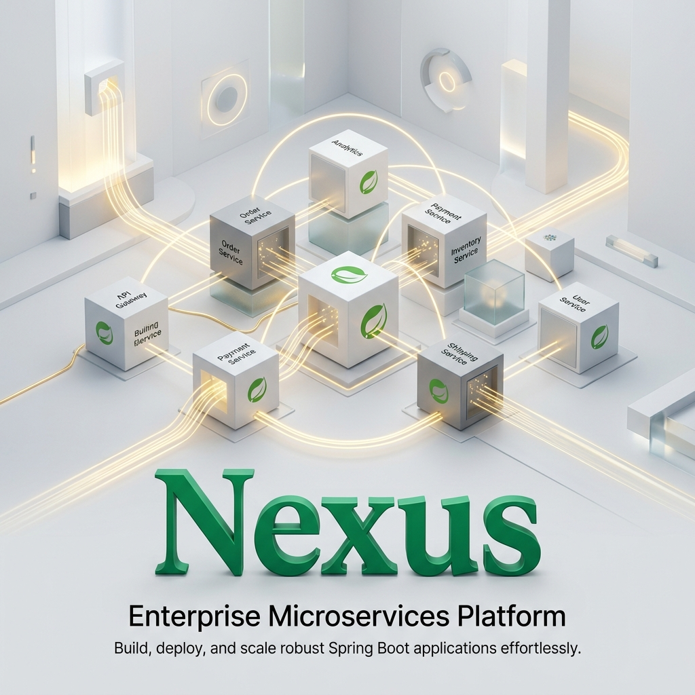
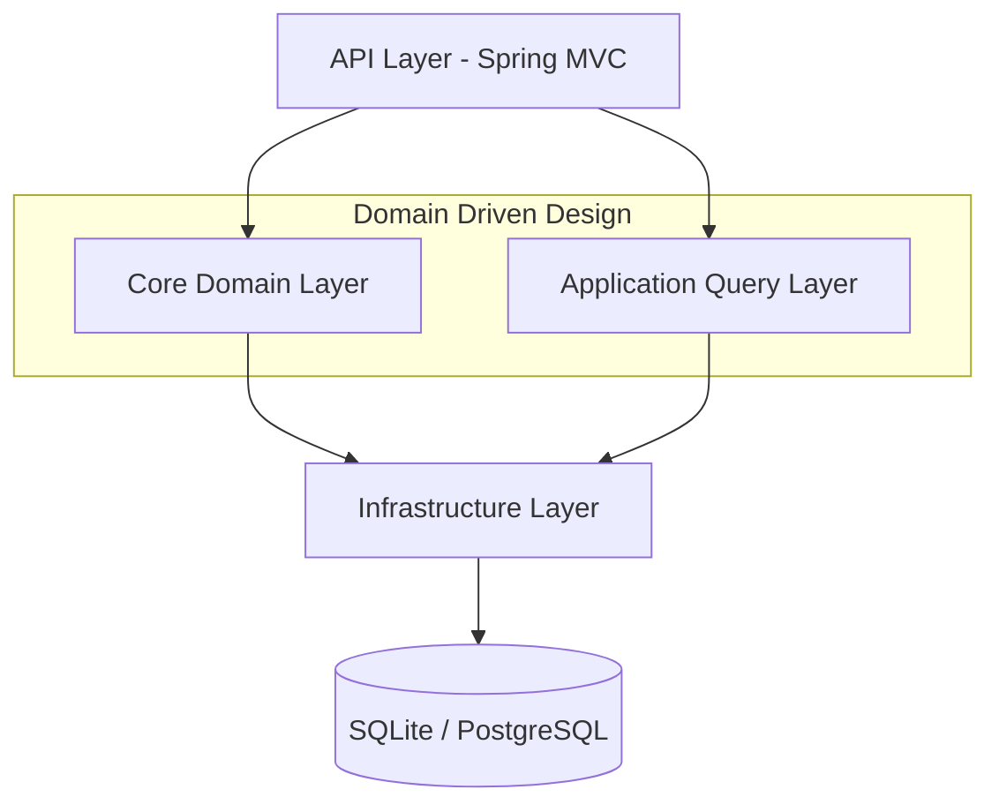
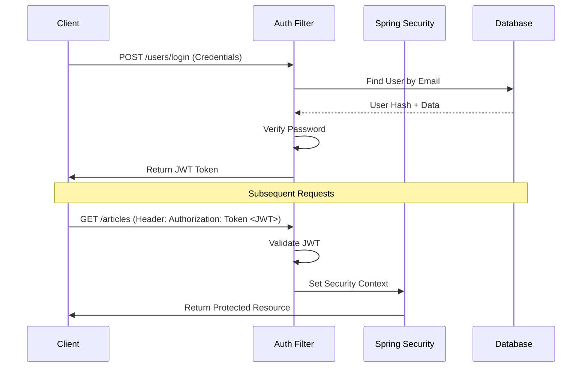

# 🍃 Nexus: Enterprise Spring Boot Microservices Platform



Nexus is a production-grade backend architecture built with **Spring Boot**, **Kotlin**, and **MyBatis**. It demonstrates advanced design patterns including **DDD (Domain-Driven Design)**, **CQRS**, and **Clean Architecture** to provide a scalable foundation for enterprise-level applications.

## 🌐 Live Demo

- **Live API Portal**: [https://saanvirajput.github.io/nexus-backend-platform/](https://saanvirajput.github.io/nexus-backend-platform/)

## 🏛️ Architectural Design

Nexus follows a strict layer separation to ensure maintainability and testability:



## ⚡ Core Technologies

- **Framework**: Spring Boot 2.7+ (Java 11/17)
- **Persistence**: MyBatis (Data Mapper Pattern)
- **Database**: SQLite (Development) / PostgreSQL (Production)
- **API**: RESTful Endpoints + GraphQL (via Netflix DGS)
- **Security**: Spring Security + JWT Stateless Authentication
- **Patterns**: CQRS for Read/Write separation, DDD for business logic

## 🔒 Authentication Flow



## 🚀 Getting Started

### Prerequisites
- Java 11 or higher
- Docker (optional)

### Installation
```bash
./gradlew bootRun
```

### Build & Test
```bash
./gradlew build
./gradlew test
```

## 🐳 Docker Deployment

Build a local image and run it:
```bash
./gradlew bootBuildImage --imageName nexus-backend
docker run -p 8080:8080 nexus-backend
```

---
*Developed and Architected by Saanvi Rajput.*
